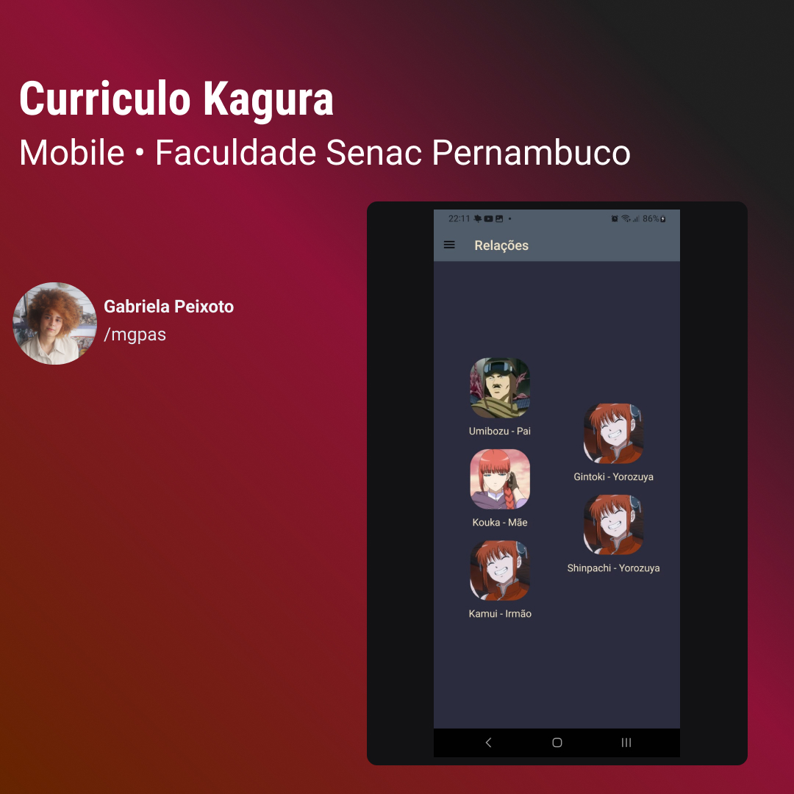

<h1 align="center"> Currículo - Kagura </h1>

Currículo para a personagem Kagura de Gintama.

  <a href="#-tecnologias">Tecnologias</a>&nbsp;&nbsp;&nbsp;|&nbsp;&nbsp;&nbsp;
  <a href="#-projeto">Projeto</a>&nbsp;&nbsp;&nbsp;|&nbsp;&nbsp;&nbsp;
  <a href="#memo-licença">Licença</a>

  

 

  

## 🚀 Tecnologias

Esse projeto foi desenvolvido com as seguintes tecnologias:

- ReactJS
- Expo
- Git e Github

## 💻 Projeto

O presente app foi desenvolvido a partir da disciplina de Coding - Mobile da faculdade Senac Pernambuco. O currículo foi proposto como uma forma de aprender a utilizar as tecnologias ReactJS e Expo. Além de estudar desenvolvimento voltado para mobile.

## :memo: Licença

Esse projeto está sob a licença MIT.

---

Feito com ♥ by mgpas 👋
